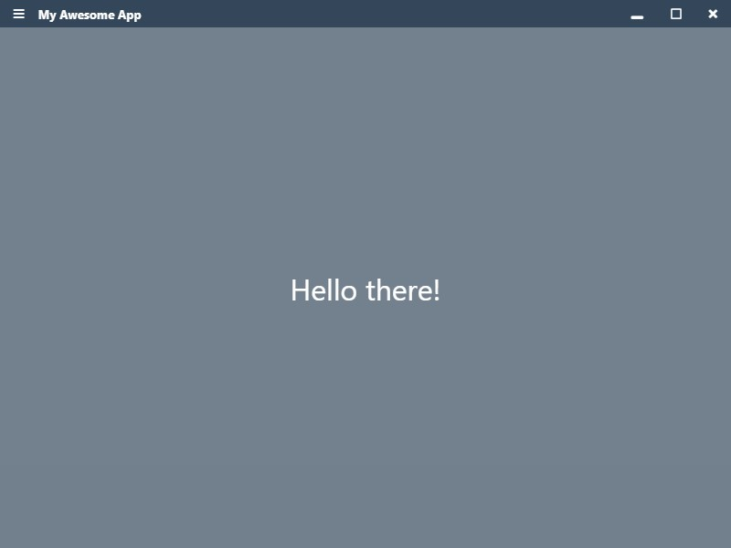
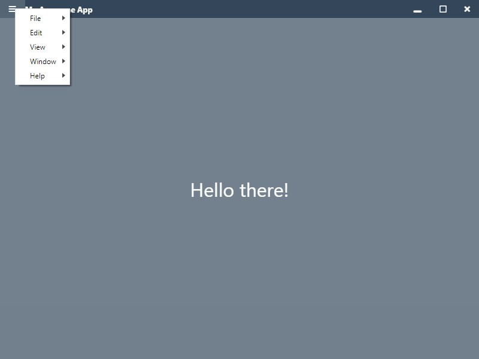
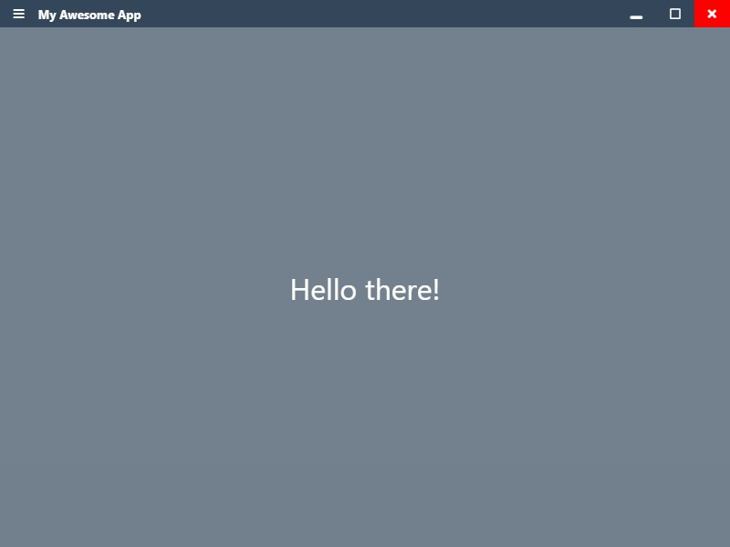

# Creating custom menu bar in Electron

You are building an electron app and want to replace that default menu bar with some thing cool. Let's see how to build a custom menu bar by building a similar one to slack's menubar.

## Pre-requisite

Basics of ElectronJS. Check [this tutorial](https://www.electronjs.org/docs/tutorial/first-app) to get started.

## Resources

Finished code is available at [https://github.com/saisandeepvaddi/electron-custom-menu-bar](https://github.com/saisandeepvaddi/electron-custom-menu-bar)

## What we'll build

Here is what it is going to look when we finish.

<p align="center">
  
</p>

<p align="center">
  
</p>

<p align="center">
  
</p>

## Set up electron project

Set up a minimal electron app from electrons's official quick start github repo.

```
# Clone the Quick Start repository
$ git clone https://github.com/electron/electron-quick-start

# Go into the repository
$ cd electron-quick-start

# Install the dependencies and run
$ npm install && npm start

```

## Main process code

**NOTE:** The code here is tested only on Windows. That is why I added extra check to work this only on Windows with the following line.

`const isWindows = process.platform === "win32";`

Remove the references and `if-else` checkes for `isWindows` accordingly to make it work across multiple platforms or whichever platform you want.

When you first run `npm start` you will see a window with a menu attached to it. In order to show our menu on hamburger icon, we need to do two things.

1. Set the `frame: false` in the `options` object for `new BrowserWindow({frame: false, ...other-options})`.
2. Register an event listener on `ipcMain` which receives mouse click position when mouse is clicked on hamburger icon.

Now, full code for `main.js` would look as follows. I've just removed all the comments from the initial cloned the repository to highlight the comments I added.

```js
// main.js

const { app, BrowserWindow, ipcMain } = require("electron");
const path = require("path");
const { menu } = require("./menu");

let mainWindow;

const isWindows = process.platform === "win32";

function createWindow() {
  mainWindow = new BrowserWindow({
    width: 800,
    height: 600,
    webPreferences: {
      preload: path.join(__dirname, "preload.js")
      // (NOT RECOMMENDED)
      // If true, we can skip attaching functions from ./menu-functions.js to window object in preload.js.
      // And, instead, we can use electron APIs directly in renderer.js
      // From Electron v5, nodeIntegration is set to false by default. And it is recommended to use preload.js to get access to only required Node.js apis.
      // nodeIntegration: true
    },
    frame: isWindows ? false : true //Remove frame to hide default menu
  });

  mainWindow.loadFile("index.html");

  mainWindow.on("closed", function() {
    mainWindow = null;
  });
}

app.on("ready", createWindow);

app.on("window-all-closed", function() {
  if (process.platform !== "darwin") app.quit();
});

app.on("activate", function() {
  if (mainWindow === null) createWindow();
});

// Register an event listener. When ipcRenderer sends mouse click co-ordinates, show menu at that point.
ipcMain.on(`display-app-menu`, function(e, args) {
  if (isWindows && mainWindow) {
    menu.popup({
      window: mainWindow,
      x: args.x,
      y: args.y
    });
  }
});

```

We need to have a menu now. You can learn how to add your own options to menu at [official docs](https://www.electronjs.org/docs/api/menu). Electron has some easy to follow documentation with examples.
For our current purpose, let's use the following menu code. Paste this in your `menu.js` file. We just need an instance of Electron's [Menu](https://www.electronjs.org/docs/api/menu#class-menu).

```js
// menu.js

const { app, Menu } = require("electron");

const isMac = process.platform === "darwin";

const template = [
  {
    label: "File",
    submenu: [isMac ? { role: "close" } : { role: "quit" }]
  },
  {
    label: "Edit",
    submenu: [
      { role: "undo" },
      { role: "redo" },
    ]
  },
  {
    label: "View",
    submenu: [
      { role: "reload" },
      { role: "toggledevtools" },
    ]
  },
  {
    role: "help",
    submenu: [
      {
        label: "Learn More",
        click: async () => {
          const { shell } = require("electron");
          await shell.openExternal("https://github.com/saisandeepvaddi");
        }
      }
    ]
  }
];

const menu = Menu.buildFromTemplate(template);
Menu.setApplicationMenu(menu);

module.exports = {
  menu
};

```

